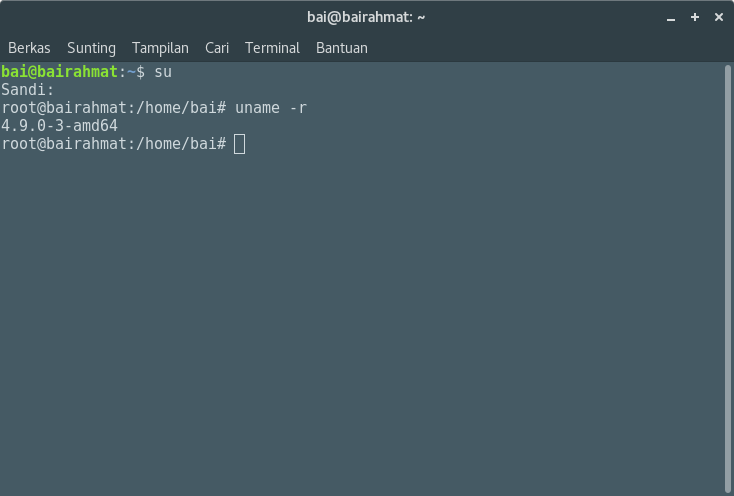
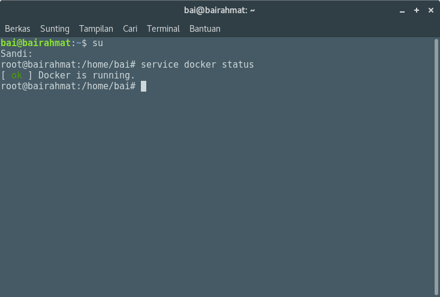
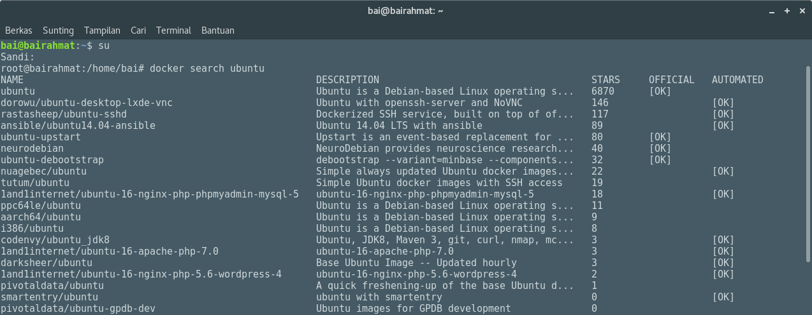

## Install Docker 
Docker adalah sebuah aplikasi yang bersifat open source yang berfungsi sebagai wadah/container untuk mengepak/memasukkan sebuah software secara lengkap beserta semua hal lainnya yang dibutuhkan oleh software tersebut dapat berfungsi.


### Install Docker di Server Debian 9
#### Prasyarat
- Sebuah virtual machine atau server yang yang terinstal system operasi ubuntu 64bit. Untuk catatan 32bit tidak mendukutng
- Versi kernel minimal 3.10 atau lebih tinggi. Untuk mengecek versi kernel. Jalankan perintah “uname -r” dari terminal


Jika versi kernel kurang dari 3.10, upgrade kernel terlebih dahulu dengan cara :
Menambahkan repo lokal di sources.list 

```
nano /etc/apt/sources.list

deb http://kambing.ui.ac.id/debian/ stretch main contrib non-free
deb http://kambing.ui.ac.id/debian/ stretch-updates main contrib non-free
deb http://kambing.ui.ac.id/debian-security/ stretch/updates main contrib non-free
```
```
apt-get update
apt-get dist-upgrade –y
```
Untuk memastikan auft storage driver didukung oleh docker, install linux-image-extra paket kernel dengan mengetikan perintah di bawah ini dan reboot server anda ketika selesai
```
apt-get install linux-image-extra-$(uname -r)
```
Atur sumber APT ubuntu anda agar bekerja dengan metode https dan sertifikat CA. Install dengan menjalankan perintah di bawah ini:
```
apt-get install apt-transport-https ca-certificates dirmngr 
```
Tambahkan GPG key repository docker untuk verifikasi
```
apt-key adv –keyserver hkp://p80.pool.sks-keyservers.net:80 –recv-keys 58118E89F3A912897C070ADBF76221572C52609D
```
Tambahkan repository Docker ke sumber APT Ubuntu dengan menjalankan perintah di bawah ini:
```
echo “deb https://apt.dockerproject.org/repo ubuntu-trusty main” | sudo tee /etc/apt/sources.list.d/docker.list
```
Untuk ubuntu 17.0 bisa coba ini :
```
apt-add-repository deb https://apt.dockerproject.org/repo ubuntu-zesty testing
```
Jalankan apt-get update untuk meng update index paket ubuntu
```
apt-get update -y
```
Install Docker engine dengan menjalankan perintah berikut
```
apt-get install docker-engine
```
Docker harusnya mulai secara otomatis setelah penginstalan selesai. Kita dapat cek service docker dengan menjalankan perintah:
```
service docker status
```


jika service docker tidak start otomatis, kita dapat menjalankannya manual dengan menjalankan perintah:
```
service docker start
```
### Bagaimana cara kerja dengan Docker
Untuk mencari image Docker yang tersedia, gunakan perintah "docker search". 
Misalnya, untuk mencari image yang tersedia untuk Ubuntu, gunakan perintah : 
```
docker search images
```


